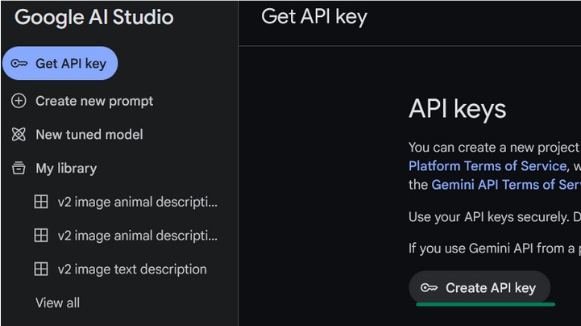
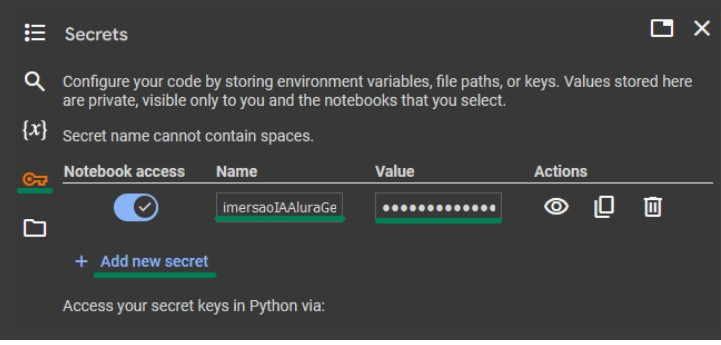
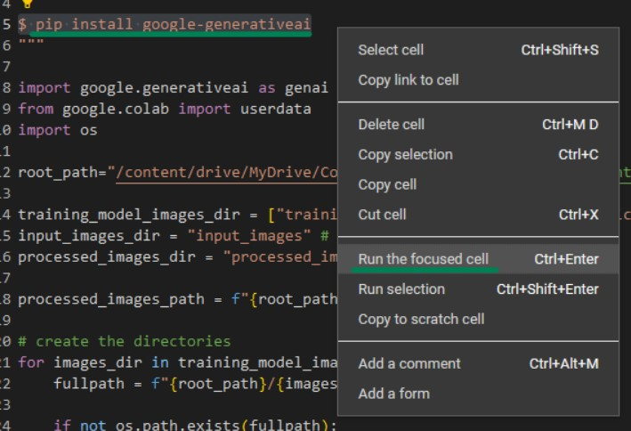
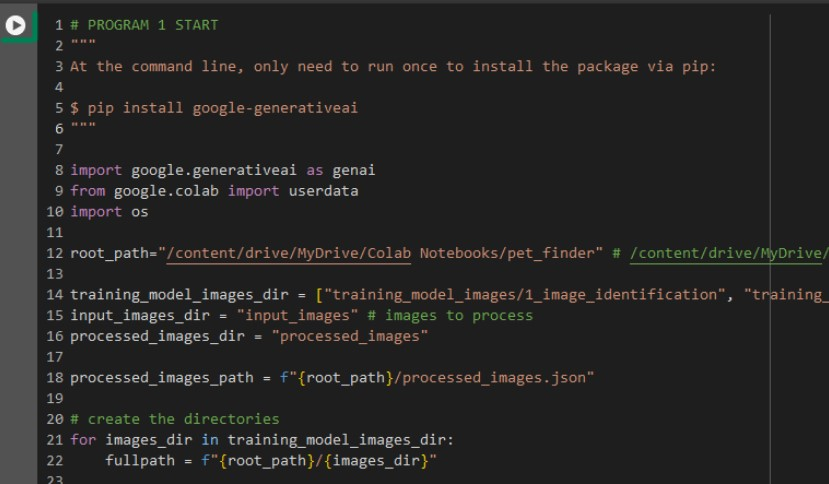
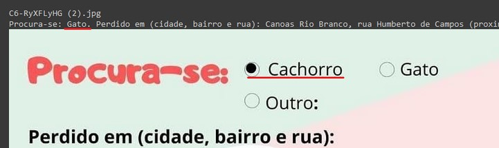
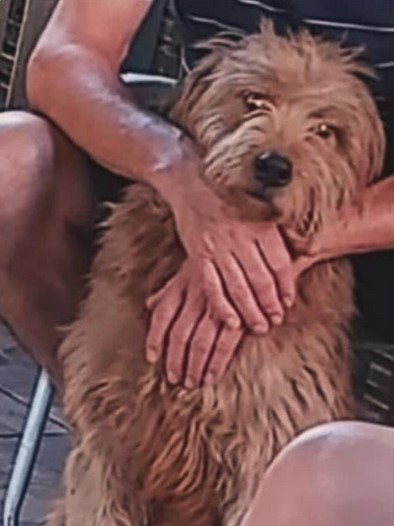
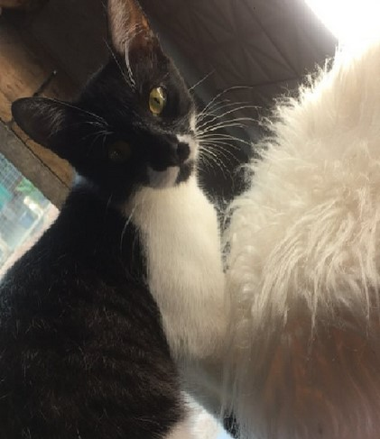

# Busca de Pets das Enchentes no Rio Grande do Sul

Este projeto consiste em um protótipo de busca de pets das enchentes no Rio Grande do Sul, utilizando o modelo de IA Gemini do Google.

## Descrição

- A busca utiliza-se das imagens dos posts do [perfil Ache seu pet RS](https://www.instagram.com/acheseupetrs/)
- Projeto baseado nas aulas da [imersão IA da Alura + Google](https://www.alura.com.br/artigos/imersao-ia)

## Funcionalidades

O projeto é dividido em duas partes:

### "Programa 1"

Entre as linhas **“# PROGRAM 1 START”** e **“# PROGRAM 1 END"**: verificação da imagem (pasta **input_images**), se representa um **pet ou texto**. Se for pet, gera a descrição de algumas de suas características; se for texto, extrai a descrição deste texto. Em ambos os casos, grava as informações em arquivo JSON, e move a imagem para a pasta **processed_images**.

### "Programa 2"

Entre as linhas **“# PROGRAM 2 START”** e **“# PROGRAM 2 END”**: busca do texto pesquisado nas descrições das imagens geradas pelo “Programa 1”, e exibição do resultado.

## Observação

Este projeto foi criado e executado no Google Colab. Caso seja executado em outra plataforma/IDE, o comportamento pode variar.

### Configurações

1. Gerar chave (API key) no [Google AI Studio](https://aistudio.google.com/app/apikey).
   

2. Abrir código do Github no [Google Colab](https://colab.research.google.com).
3. Adicionar a API key (secret) criada anteriormente no Google Colab, com o nome **“imersaoIAAluraGemini”**.
   
4. Executar **apenas uma vez** a linha “pip install google-generativeai”.
   
5. Executar a primeira parte/célula de código, responsável por criar as pastas no Google Drive.
   

### Estrutura de Pastas no Google Drive

Após a execução da célula indicada acima, a estrutura de pastas no Google Drive (/content/drive/MyDrive) deverá ser criada automaticamente. Caso contrário, criá-las manualmente:

- Colab Notebooks/pet_finder/training_model_images/1_image_identification
- Colab Notebooks/pet_finder/training_model_images/2_image_description
- Colab Notebooks/pet_finder/input_images
- Colab Notebooks/pet_finder/processed_images

### Upload de Imagens

Fazer **upload** das imagens contidas na **pasta pet_finder do repositório** para as respectivas pastas (de mesmo nome) criadas no **Google Drive**.

### Execução

No Google Colab, executar o código entre as linhas “# PROGRAM 2 START” e “# PROGRAM 2 END”.

**Nota**: Devido à quantidade de dados do JSON, pode levar cerca de 4 minutos para exibir o input para pesquisa, podendo este tempo variar conforme computador, etc.

- Caso queira testar a geração da descrição das imagens (PROGRAMA 1), adicione alguns arquivos .jpg com imagem de pet (cachorro ou gato) ou texto (de preferência imagens dos posts do [perfil Ache seu pet RS](https://www.instagram.com/acheseupetrs/)) na pasta **input_images** e, no Google Colab, execute o código entre as linhas **“# PROGRAM 1 START”** e **“# PROGRAM 1 END”**.

## Melhorias Futuras

Algumas melhorias que poderiam ser aplicadas no projeto incluem:

- Separar cada função em arquivo próprio.
- Gerar/salvar o embedding das imagens em novo campo do arquivo JSON (atualmente a cada execução do "Programa 2" o embedding é gerado novamente, levando vários minutos antes da exibição do input para a busca).
- Pesquisar a alucinação da descrição de algumas imagens e do resultado da busca (pode ser devido à pequena quantidade de imagens para treinamento / exemplo, prompt/instruções). Alguns exemplos:

  - em uma imagem que tem texto, gerou a **descrição** como sendo **Gato**, porém o radio button **Cachorro** é o que está marcado
    

  - em uma imagem de cachorro, a descrição informa ter uma **mancha branca no peito**, a qual não existe

    

  - em outra imagem, a descrição é de que **"a cauda é longa e preta\***, porém essa parte do corpo não aparece

    

- Melhorar o layout do input e da exibição do resultado.
- Evitar valores fixos e repetidos no código (hardcoded).
